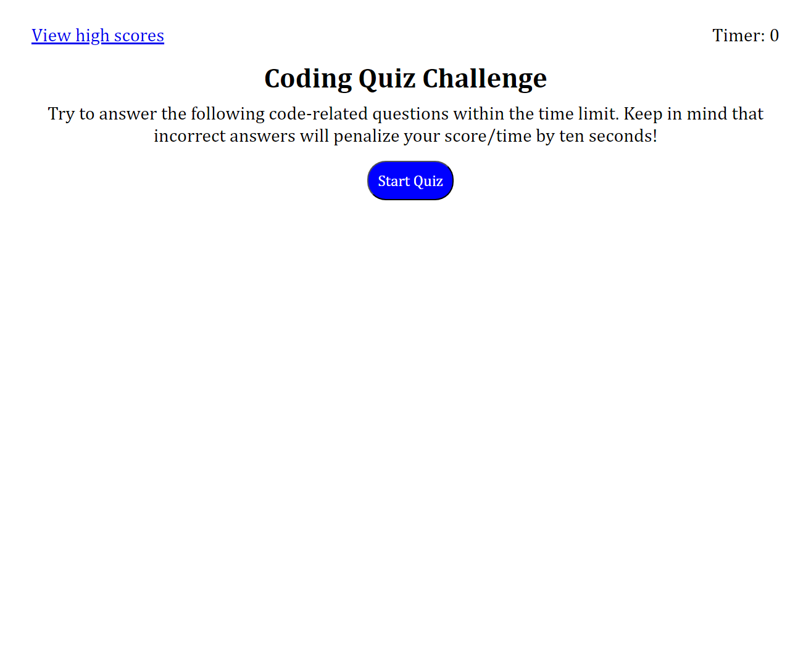

# Password_Generator

## Description

[Click this link to access the website](https://greg-pfeifer.github.io/coding_quiz_game/)

This project was completed for the purpose of creating a coding quiz game. This was good practice for using dynamic elements in Javascript as well as creating a working timer that responds to user selection. This can be used for flashcard practice as I learn more terms/methods and prepare for my first technical interview in the coming months. 

## Usage

Screenshot of deployed application

## License

Please refer to the repository to find a copy of the license.